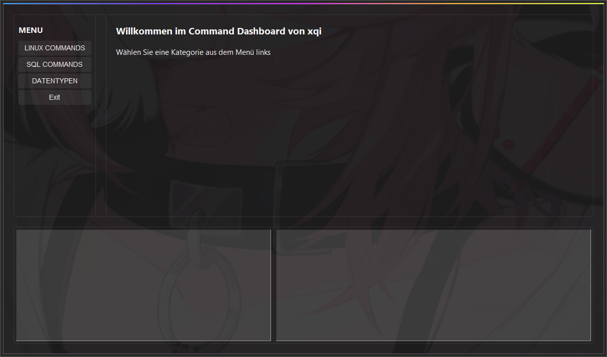
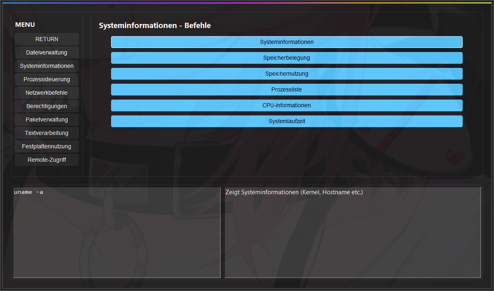

# Command Dashboard 🚀

    

A modern, dark-themed GUI dashboard with stylish Dracula design for quick access to Linux and SQL commands, plus data type references - developed with **PyQt6**.

  

---

## ✨ Features

- 🎨 **Dark Dracula Theme** with shadow effects and stylized buttons
- ⚙️ **Comprehensive Settings System** with customizable colors, fonts, and effects
- 🧭 **Main Menu with Three Sections**:
  - **Linux Commands** (file operations, networking, system commands)
  - **SQL Commands** (CRUD, tables, joins, etc.)
  - **Data Types** (numeric, string, date/time, and more)
- 🧠 **Detailed View for Each Command**:
  - Syntax & Explanation
  - Copy-to-clipboard functionality for code & descriptions
- 🧵 **SQL Syntax Highlighting** (colors: pink, yellow, cyan, purple, etc.)
- 🖱️ **Modern Buttons with Hover & Press Animations**
- 🌓 **Light/Dark Mode Toggle** with smooth transitions
- 🎛️ **Customizable UI** with adjustable font sizes, colors, and effects

---

## 🖥️ Screenshots

  


---

## 📦 Installation

```bash
# Create a virtual environment (recommended)
python -m venv venv
source venv/bin/activate  # On Windows: venv\Scripts\activate

# Install dependencies
pip install PyQt6
```

> Note: This project is based entirely on **PyQt6** for the GUI; `tkinter` is not required.

---

## 🛠️ Usage

```bash
python main.py
```

### Quick Start Guide:
1. Choose a category from the menu on the left side
2. Click a subcategory
3. Select a command to view details (syntax + explanation)
4. Use the **COPY** buttons for quick code reuse

---

## 🧰 Customization

The application includes a comprehensive settings dialog where you can customize:

- **Colors**: Background, text, button colors
- **Fonts**: Size and styles for various UI elements
- **Effects**: Shadow colors, opacity, and blur effects
- **Theme**: Switch between light and dark modes

All settings are saved automatically and will be applied the next time you start the application.

---

## 🧱 Project Structure

```text
📁 command_dashboard/
├── main.py                # Main application entry point
├── CommandDashboard.py    # Main GUI window
├── PyDraculaButton.py     # Custom button with Dracula styling
├── SettingsDialog.py      # Settings configuration dialog
├── SQLSyntaxHighlighter.py # SQL syntax highlighting
├── cfg.py                 # Configuration and style settings
└── command_data.py        # Command data structure
```

---

## 💻 Tech Stack

- **Python 3.x**
- **PyQt6** (GUI Framework)
- **Dracula Theme** (Colors, UI)
- **Object-Oriented Design**
- **SQL Syntax Highlighter** with `QSyntaxHighlighter`
- **Custom Shadow Effects** with `QGraphicsDropShadowEffect`

---

## 🔮 Planned Features

- Export commands to markdown/PDF
- Custom command categories
- Searchable command database
- User-defined command additions
- Keyboard shortcuts for common actions

---

## 🐛 Bug Reports & Feature Requests

Please open an issue on GitHub if you encounter any bugs or have feature suggestions.

---

## 📜 License

MIT License  
Copyright (c) [xqi1337](https://github.com/xqi1337)
