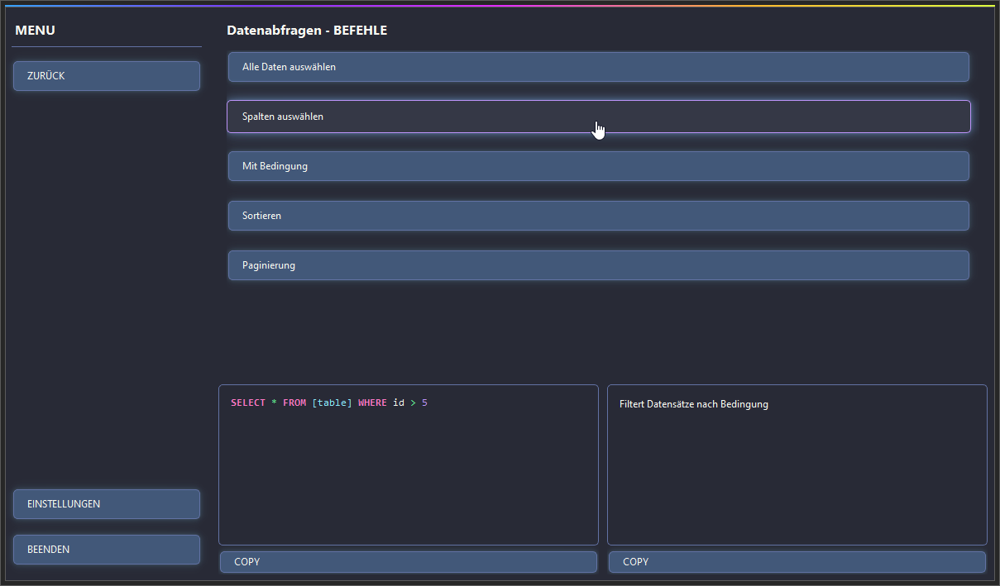

# Command Dashboard 🚀

  
  


Ein modernes, dunkles GUI-Dashboard mit stilvollem Design für schnellen Zugriff auf Linux- und SQL-Befehle sowie Datentypen-Referenzen – entwickelt mit **PyQt6** im Dracula-Style.

---

## ✨ Features

- 🎨 **Dunkles Dracula-Theme** mit Schatteneffekten und stilisierten Buttons
- 🧭 **Hauptmenü mit drei Bereichen**:
  - **Linux Commands** (Dateioperationen, Netzwerk, Systembefehle)
  - **SQL Commands** (CRUD, Tabellen, Joins etc.)
  - **Datentypen** (numerisch, string, datum/zeit uvm.)
- 🧠 **Detaillierte Ansicht für jeden Befehl**:
  - Syntax & Erklärung
  - Kopierfunktion für Code & Beschreibung
- 🧵 **Syntax Highlighting** für SQL (Farben: pink, gelb, cyan, lila etc.)
- 🖱️ **Moderne Buttons mit Hover- und Press-Animation**
- 📋 **Copy-to-Clipboard** Funktion für schnellen Workflow

---

## 🖥️ Vorschau

  


---

## 📦 Installation

```bash
pip install PyQt6
```

> `tkinter` wird **nicht** benötigt. Das gesamte GUI basiert auf **PyQt6**.

---

## 🛠️ Verwendung

```bash
python main.py
```

1. Wähle eine Kategorie im Menü auf der linken Seite
2. Klicke eine Unterkategorie
3. Wähle einen Befehl für Details (Syntax + Erklärung)
4. Nutze die **COPY**-Buttons zum schnellen Übernehmen

---

## 🧱 Projektstruktur

```text
📁 command_dashboard/
├── main.py                # Haupt-GUI (PyQt6 Fenster)
└── command_data.py        # Befehls-Datenstruktur
```

---

## 💻 Tech Stack

- Python 3.x
- PyQt6 (GUI Framework)
- Dracula Style (Farben, UI)
- Objektorientiertes Design
- SQL Syntax Highlighter mit `QSyntaxHighlighter`

---

## 📜 Lizenz

MIT License  
Copyright (c) [xqi1337](https://github.com/xqi1337)
